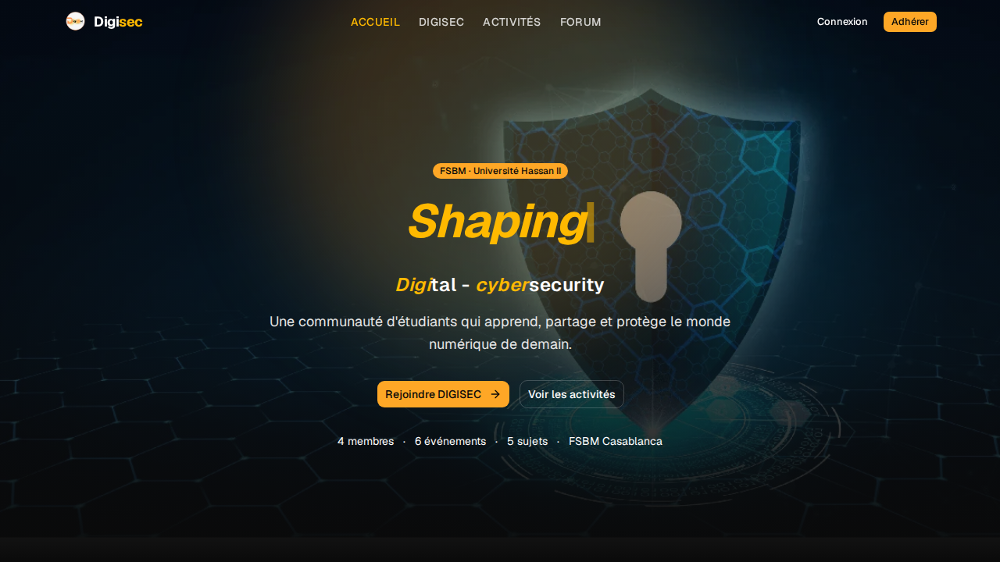

# DIGISEC

[](https://openjdk.org/)
[](https://spring.io/projects/spring-boot)
[](https://react.dev/)
[](https://mariadb.org/)
[](./docker-compose.yml)
[](https://digisec.vercel.app)

Club web application — monorepo containing the React frontend (`ui/`) and the Spring Boot REST API (`api/`).

**Live demo:** https://digisec.vercel.app (frontend-only prototype with MSW mock API; demo admin `admin@digisec.local` / `DemoAdmin123!`)



## Features

- JWT auth with email verification and role-based access (admin/member)
- Activities CRUD with image uploads
- Forum threads and replies
- Admin moderation dashboard
- French-first UI with validation messages
- Docker prod stack (`db` + `api` + `web`) and MSW-powered Vercel demo

## Tech stack

| Layer | Technology |
| --- | --- |
| Backend | Java 25, Spring Boot 4.1, Flyway, Spring Security (JWT), MariaDB 11 |
| Frontend | React 19, TypeScript, Vite, Tailwind CSS (shadcn/ui), React Query, MSW demo |
| Infra | Docker Compose, nginx SPA + `/api` proxy, Vercel prototype, Render blueprint (`render.yaml`) |
| Tests | JUnit/Vitest/Playwright E2E (`api` 67 tests, `ui` 96 tests, 32 E2E per prototype notice) |

## Layout

```
├── ui/    React 19 + TypeScript + Vite + Tailwind CSS (shadcn/ui)
└── api/   Spring Boot 4.1 (Java 25, Maven) + MariaDB
```

## Prerequisites

- Node.js 22+
- JDK 25+ (Maven Wrapper included, no global Maven needed)
- MariaDB 11+ (or MySQL 8+)
- Docker + Docker Compose (for production-like stack)

## Development

### Option A — Docker (recommended, no 502)

```bash
cp .env.example .env   # set JWT_SECRET (32+ chars), DB_ROOT_PASSWORD, DB_PASSWORD
sg docker -c "docker compose up --build -d"
# Frontend: http://localhost          (nginx serves ui/dist, proxies /api → api:8080)
# API health: curl http://localhost/api/v1/activities
```

### Option B — Local (Vite dev + Spring Boot)

Requires a running MariaDB (`systemctl start mariadb`).

```bash
# Terminal 1 — API
cd api
export DB_USERNAME=digisec DB_PASSWORD=digisec
export JWT_SECRET=local-test-secret-0123456789abcdef
./mvnw spring-boot:run   # http://localhost:8080
```

```bash
# Terminal 2 — UI
cd ui
npm install
npm run dev              # http://localhost:5173, proxies /api → localhost:8080
```

> **502 on Activities/Forum?** You mixed the two workflows: `npm run dev` (:5173) needs `api` at `:8080` on the host (Option B). With `docker compose up`, use `http://localhost` (:80 nginx, not :5173). `api` is now exposed at `8080:8080` for either workflow, but don't run both APIs at once.

Runs on `http://localhost:8080` (`/actuator/health` is public); Swagger UI at `/swagger-ui.html` (proxied as `/api/v3/api-docs` in Docker).

| Env var | Default | Purpose |
| --- | --- | --- |
| `DB_HOST` / `DB_PORT` / `DB_NAME` | `localhost` / `3306` / `digisec` | MariaDB connection |
| `DB_USERNAME` / `DB_PASSWORD` | `root` / empty | Database credentials |
| `JWT_SECRET` | dev-only fallback | HMAC signing key (32+ bytes) |
| `JWT_EXPIRATION_MS` | `86400000` (24 h) | Access token lifetime |
| `SMTP_HOST` / `SMTP_PORT` | `localhost` / `587` | Outgoing mail server |
| `SMTP_USERNAME` / `SMTP_PASSWORD` | empty | SMTP credentials |
| `FRONTEND_URL` | `http://localhost:5173` | Base URL used in verification links |
| `STORAGE_LOCATION` | `./uploads` | Activity image storage directory |
| `SEED_ADMIN` / `ADMIN_EMAIL` / `ADMIN_PASSWORD` | `true` / `admin@digisec.local` / value in your `.env` (prod boots refuse the default) | Dev admin seeding |

### UI

```bash
cd ui
npm install
npm run dev
```

Runs on `http://localhost:5173`; `/api/*` requests are proxied to the backend.

Run both stacks in parallel for full functionality (auth, forum, activities).

```bash
npm run lint   # oxlint
npm run build  # tsc + vite production build
npm test       # vitest
```

## Quickstart

```bash
cp .env.example .env   # fill JWT_SECRET (32+ chars) + DB passwords
docker compose up --build -d   # http://localhost (prod-like)
# or: cd api && ./mvnw spring-boot:run & cd ui && npm run dev   # http://localhost:5173
```

### Prototype (frontend-only demo, e.g. Vercel)

The backend isn't hosted yet, so the demo ships the UI with an MSW worker
(`ui/src/mocks/`) that simulates the full API in the browser — stateful seed,
auth, validation errors, French messages — persisted to localStorage:

```bash
cd ui
VITE_MOCK_API=true npm run build   # or set VITE_MOCK_API=true in Vercel
```

Vercel settings: root `ui/`, build `npm run build`, output `dist`
(`ui/vercel.json` holds the SPA rewrite). Never set `VITE_MOCK_API` in
Docker/CI — it would hijack the real backend. Demo admin:
`admin@digisec.local` / `DemoAdmin123!`.

Legacy PHP (`public/`) was removed in `v1.0.0` — recoverable at tag `legacy` and in history (`main` pre-merge).

## License

MIT — see [LICENSE](./LICENSE).
